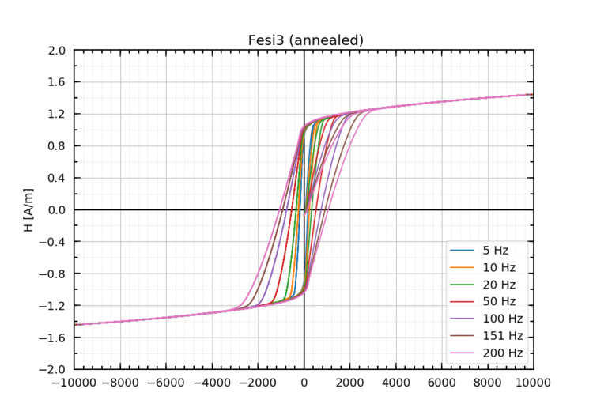

# HystAPI

HystAPI is a module to process, evaluate and produce ready-to-publish hysteresis plots from magnetic measurements. It can be be imported to an interactive python command line or to other python scripts (like in test.py).

The core functionality of the API is collected in three classes:
- **Hyst**: represents the data from one hysteresis measurement
- **Curve**: collects multiple instances of Hyst measured at different frequencies to represent the frequency dependence of key-characteristics of the magnetic sample (e.g. magnetization losses, coercive field, etc.)
- **Measurement**: collects multiple instances of Curve for different magnetic samples and can produce ready-to-publish plots which compare key-characteristics of magnetic materials across different samples

As an illustrative example how to use HystAPI, some data from hysteresis measurements of five heavily deformed FeSi3 rings (standard electric steel) is placed  in the folder **/testData**. Executing the python3 script **test.py** (which uses HystAPI.py to process the FeSi3 data) produces plots of the hystereses, of the magnetization losses, the coercive field, etc. and a file containing fit parameters for these plots. For example these two plots were 
created from this testdata:

